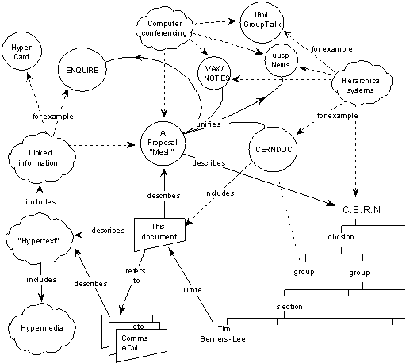
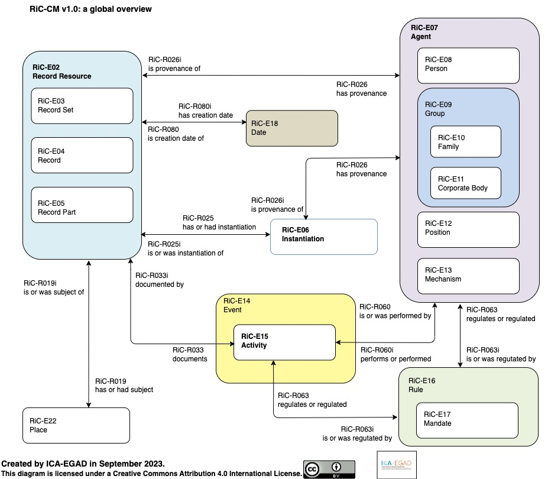

# 웹은 처음부터 아카이브였다

웹에서 우리는 읽고, 보내고, 소비한다. 정보는 흘러가는 것이지, 쌓이는 것이 아니다—적어도 지금은 그렇게 느껴진다. 그러나 웹을 발명한 팀 버너스리(Tim Berners-Lee)가 처음 제출한 제안서의 제목은 "Information Management: A Proposal"(정보 관리: 하나의 제안)—정보 관리였다.[^1] 1989년 3월, CERN(유럽입자물리연구소)의 컴퓨터과학자였던 그의 과제는 웹 페이지를 만드는 것도, 멀티미디어를 전달하는 것도 아니었다. 그는 조직 안에서 끊임없이 사라지는 정보를, 어떻게 관리할 것인지를 해결하고자 했다.

## 1989년, 두 개의 평행 우주

CERN에서 버너스 리는 문제를 이렇게 정의했다. "Information is recorded but cannot be found."(정보는 기록되었다. 그러나 찾을 수 없다.)[^1] 물리학 연구소에서 연구원들은 평균 2년만 머물다 떠났다. 누군가 작성한 문서, 누군가 만든 소프트웨어, 누군가 수집한 데이터는 그 사람이 떠나면 함께 사라졌다. 문제는 기록의 부재가 아니라 **참조의 불가능**이었다. 정보는 존재하지만, 서로 연결되지 않았다. 누가 무엇을 만들었는지, 어떤 문서가 어떤 프로젝트에 의존하는지, 이 소프트웨어가 무엇을 참조하는지—이런 관계가 기록되지 않았다.

버너스 리가 제안한 것은 "a pool of information which could grow and evolve"(성장하고 진화할 수 있는 정보의 저장소)—조직과 함께 성장하고 진화하는 정보의 저장소였다. 기존의 파일 시스템이나 데이터베이스는 정보를 계층 구조—폴더 안의 폴더, 테이블 안의 행—로 정리했다. 그러나 실제 세계에서 정보는 여러 맥락에 동시에 속한다. 한 문서는 여러 프로젝트에서 참조되고, 한 사람은 여러 팀에 속하고, 한 소프트웨어는 여러 의존성을 가진다. 계층 구조는 모든 정보를 하나의 부모 아래 배치한다. 버너스리의 대답은 명확했다. "A tree does not allow the system to model the real world."(트리는 시스템이 실제 세계를 모델링하도록 허용하지 않는다.)

*버너스리가 제안서에 그린 다이어그램. 사람, 문서, 소프트웨어, 프로젝트가 원으로, 그들 사이의 관계("depends on", "refers to", "made" 등)가 화살표로 표현되어 있다. 폴더 구조가 아닌 네트워크 구조다. — "Information Management: A Proposal" (1989)*

이 다이어그램에는 폴더도, 계층도 없다. 대신 사람, 문서, 소프트웨어, 프로젝트가 원으로 흩어져 있고, 그것들을 잇는 화살표에는 관계의 이름이 적혀 있다. "depends on"(의존한다), "is part of"(~의 부분이다), "made"(만들었다), "refers to"(참조한다), "uses"(사용한다). 중요한 것은 그 화살표가 **관계의 타입**을 표현했다는 점이다. 링크는 단순히 "연결됨"이 아니었다. 링크는 **의미의 기록**이었다. 1989년, 버너스리는 정보를 네트워크로 엮었다. 같은 해, 기록학은 여전히 종이가 제공하는 선형적 순서의 세계관에 머물러 있었다.

그 무렵, 기록학계는 전혀 다른 위기를 겪고 있었다. 아키비스트들이 전자기록을 다루기 시작한 것은 1960년대부터였다. 그러나 분산 컴퓨팅, 관계형 데이터베이스, 이메일이 확산되면서, 테이프를 복사하고 포맷을 변환하는 식의 1세대 보존 방법론은 한계에 부딪혔다. 캐나다 기록학자 테리 쿡(Terry Cook)은 새로운 세대의 전자기록에 대응하는 논문을 쓰면서 "Easy to Byte, Harder to Chew: The Second Generation of Electronic Records Archives"(깨물기[byte: 바이트]는 쉽지만, 씹기는 어렵다: 제2세대 전자기록 아카이브)라는 제목을 붙였다.[^2] 전자기록은 만들기는 쉽지만, 관리하기는 어렵다는 뜻이었다.

그럼에도 기록학이 내놓은 표준은 기존 체계의 연장이었다. 1990년 캐나다는 RAD(기록물 기술 규칙, Rules for Archival Description)를 발표했다. 1993년 국제기록학협회(ICA, International Council on Archives)는 ISAD(G)(국제표준 기록물 기술 일반원칙, General International Standard Archival Description)를 승인했다. 둘 다 엄격한 계층 구조였다. Fonds(기록군) → Series(시리즈) → File(파일) → Item(개별 문서). 서가 위의 상자, 상자 안의 폴더처럼 물리적 공간에서 비롯된 이 질서를, 디지털 환경에도 그대로 적용하려 한 것이다.

웹이 공개된 1991년 8월, 기록학 문헌에서 "hypertext"(하이퍼텍스트)나 "network structure"(네트워크 구조)는 거의 언급되지 않았다. 두 세계는 같은 문제—정보 관리—를 다루고 있었지만, 서로를 알지 못했다.

## 같은 구조, 34년의 차이

2023년, 국제기록학협회(ICA)는 **Records in Contexts (RiC)** 온톨로지 버전 1.0을 발표했다.[^3] 30년간 유지된 계층 구조가 마침내 한계를 드러낸 결과였다. 현실의 기록은 단일한 출처에 속하지 않았다. 하나의 문서가 여러 조직에 걸쳐 생산되고, 하나의 프로젝트가 여러 기관의 기록에 흩어져 있었다. 호주 국립기록보존소(NAA)의 케어리 가비(Carey Garvie)와 제임스 도이그(James Doig)는 이렇게 인정했다. "We have tended to impose an analogue view onto digital records, resulting in a rich source of data being effectively hidden."(우리는 아날로그적 관점을 디지털 기록에 강제해왔고, 그 결과 풍부한 데이터가 사실상 숨겨졌다.)[^4]

RiC는 이 인식 위에 세워졌다. Fonds(기록군) → Series(시리즈) → File(파일) → Item(개별 문서)의 단일 계층을 버리고, RiC는 개체(entity)와 관계(relation)의 네트워크를 택했다. Record(기록), Agent(행위자), Activity(활동), Rule(규칙), Place(장소), Date(날짜)가 "created by"(~에 의해 생성됨), "used by"(~에 의해 사용됨), "subject of"(~의 주제) 같은 관계로 얽혀 있었다.

*Records in Contexts (RiC) 개념 모델 개요 (ICA, 2023)*

흥미로운 것은 **둘이 같은 세계관에 도달했다는 사실**이다. 버너스리의 1989년 다이어그램과 비교해보라. 둘 다 정보를 계층이 아닌 개체(entity)와 관계(relation)의 그래프로 모델링한다. 둘 다 관계에 의미를 부여한다. 차이는 **34년의 시간**이다.

왜 이렇게 오래 걸렸을까? 기록학이 계층 구조를 벗어나지 못한 것은 단순한 기술 부재의 문제가 아니었다. 전통 기록학은 *개별 기록물 단위*로 세계를 파악했다. 이 문서는 무엇인가, 누가 만들었는가, 어떤 기록군에 속하는가. 그러나 디지털 환경에서 기록은 개별 단위로 환원되지 않는다. 에밀리 마에무라(Emily Maemura)가 웹 아카이브 사례로 보여준 것처럼, 한 웹사이트는 수천 개의 페이지, 수만 개의 링크, 여러 시점의 스냅샷으로 구성되며, 이를 기술하려면 집합 수준(aggregate-level)의 새로운 프레임워크가 필요했다.[^5] RiC가 요구한 것은 기술 모델의 전환만이 아니라, **사고방식 자체의 전환**이었다.

RiC의 혁신은 바로 그 집합 수준에서의 기술이다. 개별 페이지가 아니라 페이지들의 관계, 개별 문서가 아니라 문서들이 형성하는 네트워크를 기술 대상으로 삼는다. 버너스리가 1989년에 "circles and arrows"(원과 화살표)로 그린 것—개체와 관계의 네트워크—을 기록학이 공식 표준으로 수용하기까지 34년이 걸렸다.

## 보존의 시대, 여전한 거리

1996년, 컴퓨터 엔지니어 브루스터 케일(Brewster Kahle)이 **[인터넷 아카이브(Internet Archive)](https://archive.org)**를 설립했다. "모든 지식에의 보편적 접근"을 표방한 이 프로젝트의 당면 과제는 웹을 보존하는 것이었다. 그러나 케이티 헤가티(Katie Hegarty)의 2022년 연구가 밝힌 것처럼, 인터넷 아카이브는 역설적으로 **도서관 프레임워크**를 이식했다.[^6] 웹사이트를 "출판물"로 다루고 서지 메타데이터(제목, 저자, 발행일)를 붙였다. 웨이백 머신(Wayback Machine)은 웹페이지를 시점별 스냅샷으로 저장했다—마치 책의 판본처럼. 2001년 버전, 2005년 버전, 2010년 버전.

도서관 프레임워크는 웹을 보존하는 데는 성공했지만, 웹의 *구조적 본질*을 놓쳤다. 웹은 출판물이 아니라 링크의 네트워크였다. 한 페이지는 다른 페이지들을 참조하고, 여러 사이트는 서로 링크하며, 그 관계 자체가 의미를 만들었다. 그러나 웨이백 머신은 개별 페이지를 스냅샷으로 저장했다. 링크는 HTML 안에 남아 있었지만, 링크들이 형성하는 네트워크 구조를 기술하는 체계는 없었다.

웹 아카이빙의 논의는 보존 기술의 문제로 축소되었다. 크롤러를 어떻게 개선할 것인가, WARC(Web ARChive) 포맷을 어떻게 표준화할 것인가, 저장 용량을 어떻게 확보할 것인가. 그러나 웹의 본질은 개별 페이지가 아니라 페이지 사이의 연결에 있었다. 페이지를 오래 보존하는 데 성공할수록, 정작 그 페이지를 웹이게 만드는 것—링크의 네트워크—은 시야에서 사라졌다. **구조적 함의**—웹이 기록학에 던지는 질문—는 논의되지 않았다. 웹을 보존하는 엔지니어와 기록을 기술하는 아키비스트는 서로 다른 세계에 살았다.

## CERN의 아이러니

아이러니는 더 깊다. 웹을 발명한 CERN조차 자신의 웹 역사를 제대로 아카이빙하지 못했다. 이탈리아 기록학자 마테오 포마시(Matteo Fomasi)와 동료들의 2023년 연구가 밝힌 CERN WWW 컬렉션의 실상은 역설적이다.[^7]

이 컬렉션은 체계적 계획의 산물이 아니었다. 1992년, 웹의 공동 발명자 로베르 카이요(Robert Cailliau)의 아내가 그에게 권유했다. "당신이 하는 일이 중요해 보이니 기록을 남겨두는 게 어때요?" 카이요는 후에 회고한다. "I just did not think of it. The historical aspect was disregarded."(나는 그저 생각하지 못했다. 역사적 측면은 무시되었다.) 웹이 역사적으로 중요해질 거라고는 아무도 예상하지 못했다. 그들에게 웹은 그저 CERN 내부의 정보 관리 도구—버너스리가 제안서 제목에 쓴 바로 그 단어—였다.

팀 버너스리의 문서 대부분은 **부재**한다. 1994년 그는 MIT(매사추세츠 공과대학)로 옮겼고, 개인 문서들을 가져갔다. CERN 컬렉션에는 그의 초기 제안서, 코드, 이메일이 거의 없다. 1993년 CERN이 웹 기술을 공개 도메인으로 선언한 원본 문서는 **사라졌다**. 웹 역사에서 가장 중요한 법적 선언문의 원본을, 아무도 보존하지 않았다.

CERN의 공식 아카이브 정책은 **1997년에야** 수립되었다. 웹이 공개된 1991년으로부터 6년 후였다. 그 사이 수많은 문서가 흩어졌다. 일부는 CERN에, 일부는 MIT에, 일부는 프랑스 INRIA(국립정보자동화연구소)에, 일부는 영국 도서관에, 일부는 개인의 집에. 일부는 사라졌다.

**정보 관리 시스템을 만든 곳이 정보를 관리하지 못했다.** 버너스리가 1989년에 진단한 문제—"정보는 기록되었다. 그러나 찾을 수 없다"—는 웹 자체의 역사에서 그대로 재현되었다.

## 34년 후의 수렴, 그리고 남은 질문

2013년, 국제기록학협회(ICA)는 RiC 개발에 착수했다. 그리고 2023년, 웹 발명으로부터 34년 후, 기록학은 드디어 네트워크 기반의 기술(description) 모델에 도달했다. 버너스리가 1989년에 원과 화살표로 그렸던 것—개체와 관계의 네트워크—을, 기록학이 공식 표준으로 받아들이기까지 걸린 시간이다.

웹은 처음부터 아카이브였다. 정보를 저장하는 시스템이 아니라, 정보 사이의 관계를 기록하는 시스템이었다. 링크는 단순한 연결이 아니라, 의미의 타입을 표현하는 관계였다. 문제는 기록학이 그것을 읽지 못했다는 데 있다.

두 세계는 같은 문제를 다루면서도 만나지 못했다. 웹 발명자들은 기록학을 참조하지 않았고, 기록학자들은 웹의 구조를 주목하지 않았다. 남은 질문은 이것이다. RiC가 웹의 구조를 닮아가는 지금, 기록학은 웹으로부터 무엇을 다시 배워야 하는가.

---

## 각주

[^1]: Berners-Lee, T. (1989). *Information Management: A Proposal*. CERN. <https://www.w3.org/History/1989/proposal.html>
[^2]: Cook, T. (1991). Easy to byte, harder to chew: The second generation of electronic records archives. *Archivaria*, 33, 202-216.
[^3]: International Council on Archives. (2023). *Records in Contexts (RiC) Ontology Version 1.0*. <https://www.ica.org/standards/RiC/>
[^4]: Garvie, C. & Doig, J. (2022). Reimagining the Commonwealth Record Series System. *Archives & Manuscripts*, 50(1), 71-80. <https://doi.org/10.37683/asa.v50.10457>
[^5]: Maemura, E. (2025). Conceptualizing aggregate-level description in web archives. *Archival Science*, 25, 119-143. <https://doi.org/10.1007/s10502-024-09441-3>
[^6]: Hegarty, K. (2022). The invention of the archived web: Tracing the influence of library frameworks on web archiving infrastructure. *Internet Histories*, 6(4), 432-451. <https://doi.org/10.1080/24701475.2022.2103592>
[^7]: Fomasi, M., Barcella, D., Benecchi, E., & Balbi, G. (2023). Genealogy of an archive: The birth, construction, and development of the World Wide Web collection at CERN. *Internet Histories*, 7(3-4), 277-294. <https://doi.org/10.1080/24701475.2023.2188448>

---

## 태그

#웹 #디지털_아카이브 #인터넷_아카이브

---

## 연재 정보

이 글은 **〈웹 이후의 기록학〉** 6부작 연재 시리즈 입니다.

- **#1: 웹은 처음부터 아카이브였다**
- #2–#6: 계속
